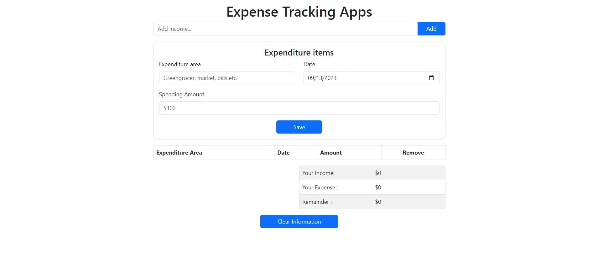

# Project Name

Expense Tracking Apps

## Description

In this application, the monthly income and expenses entered by the user are listed in a table, the income and expense totals are calculated, and finally the remaining income amount is displayed. In addition, all income and expense data saved in local storage...

## Project GIF

### The project includes the following topics and tools;

- HTML
- CSS
- Bootstrap
- JavaScript
- Local Storage

## Contributing

We would greatly appreciate your contributions to the project. Your help and contributions are highly valuable to us.

## Demo

You can access the live demo of the project using the following link:

[Live Demo](https://imoguz.github.io/expense-tracking-apps/)

## Contact

If you have any questions, suggestions, or would like to get in touch, please feel free to reach out:

- [LinkedIn Profile](https://www.linkedin.com/in/im-abdullah-oguz/)
- [Email Address](mailto:imoguz0510@gmail.com)
