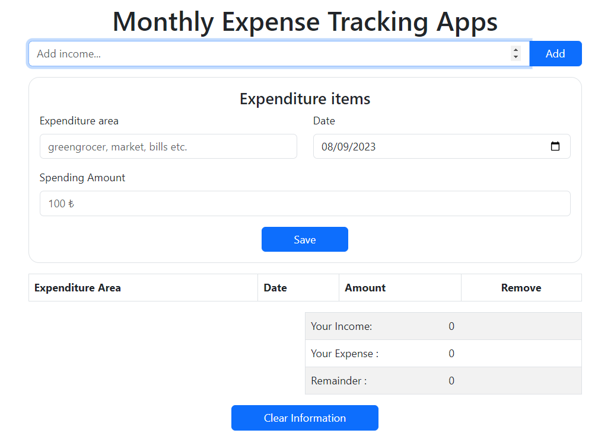

# Project-001 : Monthly Expense Tracking Apps

## Description

In this application, the monthly income and expenses entered by the user are listed in a table, the income and expense totals are calculated, and finally the remaining income amount is displayed.

## Project GIF

### The project includes the following topics and tools;

- HTML
- CSS
- Bootstrap
- JavaScript
- Local Storage
